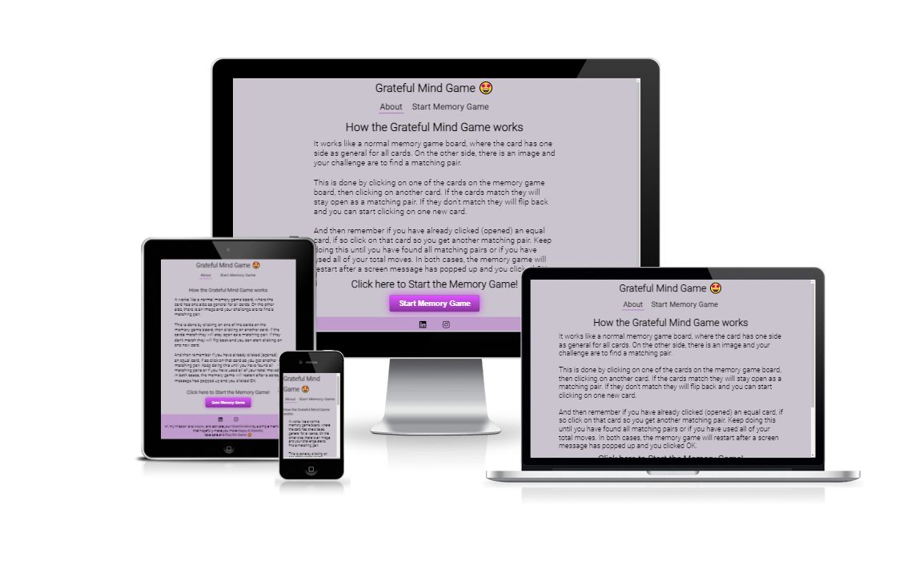
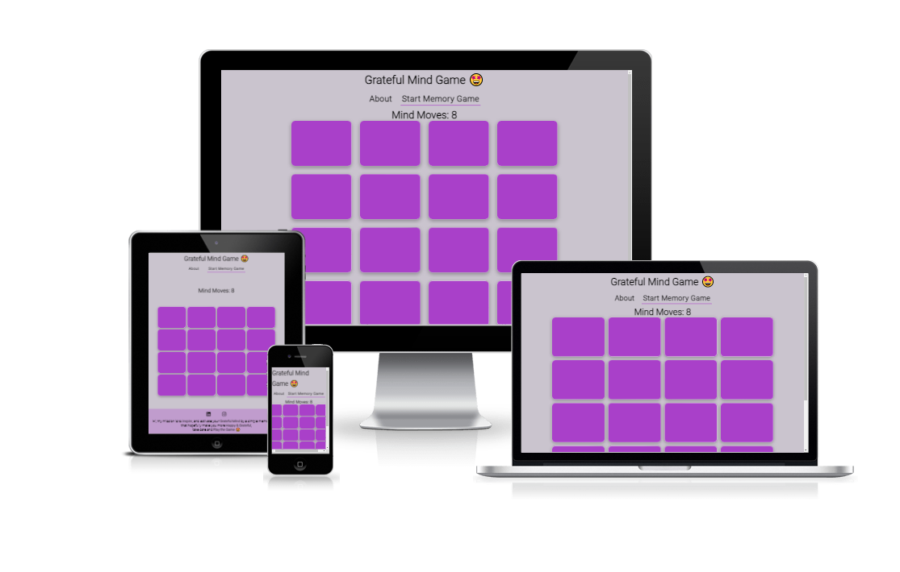

# Grateful Mind Game

Everyone needs to practice and train their mind to be happier and grateful. If we do this we create and develop a more positive mental activity. It will increase our memory with more positive thinking, hopefully even smile and be happier in general.

For example; Grateful Mind Game is a site that wants to help people practice and train their minds to both create and develop a more positive mental activity. This is a simple memory game (puzzle) that let you click on the card that flips and then shows different pictures, when two cards match you should find the next matching card. When the whole game board is done it will start over again.

## Features 

The site user wants to play an easy online game that has elements of practice and positively trains their mind. The user should be able to read and play the game from small mobile devices, tablets, and computers with screen sizes from 375px and up.  

### Existing Features

- __Greatful Mind Game (The landing & about page)__

  - The landing page is where the user can read about how the Grateful Mind Game is working. The user have have the possibility to read the description first and then click on the button Start Memory game or use the menu with the same name.
  - This will allow the user to easily navigate from page to page across the site without having to revert to the previous page via the ‘back’ button. 

- __The Memory Game Page__

  - This is the Memory Game page where the baseline is equal to the landing & about page when it comes to the header and menu and footer section.
  - The area between is the gaming area, first how many moves does the user have to solve the memory game board on then the Memory Game board with all the cards showing the backside up. When the user clicks on one card it will open the front side and after the second card is clicked it will check for matching. If so the user can keep clicking on the next card of the user's choice. If they don't match the cards that were opened will flip back, and the user needs to choose new cards. When the game is solved or the moves have ended the user will receive a screen message and need to click OK, then the game will be reset and can be played again. 

                                                                                                                                                                                                                                                
- __The Footer__ 

  - The footer section includes links to the relevant social media sites for further guidance to becoming a more happy and more grateful person.
  - The footer is valuable to the user as it encourages them to keep connected via social media.

### Features that can be Implement

- Extend levels
- Extend difficulties
- Personal score system
- time limits/levels/difficulties
- A time frame - before the same user can play again (like a break, go for a walk, drink coffee, etc.)

## Testing

I have used gitpod, GitHub, and google dev tools during my design and testing phases. Used git commands for saving and pushing the code from gitpod to GitHub.

Under the tests, I have only used google chrome as a web browser!

I have had a lot of problems/issues during the design and testing phase regarding the interaction between HTML, CSS, and JS. One big thing has been to read and viewing of the code, like Swedish/English language, reading/viewing text (code) on the screen. The basic problem has been typing errors and using the wrong tags, elements, attributes, functions, declarations, etc. I have used code Institute as a baseline for information, the slack community, w3school, and YouTube for guidance. And also used my mentor for the code institute for support and guidance.

### Validator Testing 

- HTML
  - No errors were returned when passing through the official [W3C validator](https://validator.w3.org/nu/?doc=https%3A%2F%2F777osek.github.io%2Fmind-game%2Findex.html&showsource=yes)
- CSS
  - No errors were found when passing through the official [(Jigsaw) validator](https://jigsaw.w3.org/css-validator/validator?uri=https%3A%2F%2F777osek.github.io%2Fmind-game%2F&profile=css3svg&usermedium=all&warning=1&vextwarning=&lang=sv)
- JS
  - No errors were found when passing through the official JSHint JavaScript Validator:
Metrics - There are 15 functions in this file. The function with the largest signature takes 2 arguments, while the median is 0.
The largest function has 14 statements in it, while the median is 2. The most complex function has a cyclomatic complexity value of 5 while the median is 1.

### Unfixed Bugs

According to my knowledge, there are no unfixed bugs, and why they were not fixed.

## Deployment

The project started with the code institute template and their README.md template to create this mind-game project on GitHub. All project work has been done via gitpod beside the README.md file has been updated via GitHub.

The live link can be found here - [mind-game](https://777osek.github.io/mind-game/)

## Credits 

The credits go to Östen Ekvall for his ideas, the content of the texts and pictures (images), and the code institute for their basic templates for my web design. The button was coded from this site https://buttonoptimizer.com/. Of cause the W3school for their site and helping guides etc. https://www.w3schools.com/.

Also these people from their YouTube clips:
- https://www.youtube.com/watch?v=-tlb4tv4mC4
- https://www.youtube.com/watch?v=ZniVgo8U7ek&t=258s
- https://www.youtube.com/watch?v=Gi3INcPOvo8&t=601s
- https://www.youtube.com/watch?v=vQAvjof1oe4&t=184s

### Content

- All content text is coming from Östen Ekvall and his affirmation images for becoming a more happy and grateful person every day
- Icons were taken from [Font Awesome](https://fontawesome.com/) but also standard emojs from https://emojipedia.org/wrapped-gift/

### Media

- The images comes from Östen Ekvall

Congratulations this is the second README file, I hope you will have a happy and grateful life as a developer and as an amazing person!
